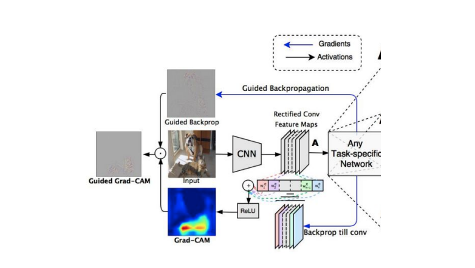

# Applying GradCAM on a DQN agent for playing the game breakout from the atari games

#### This is a toy project for integrating GradCAM algorithm with a DQN agent on the game breakout. There is a code for making a video animation of the GradCAM results while the agent is playing the game.
### visualization

 NOTE: Parts of the code is taken from [this](https://github.com/Mateus224/Visual-Explanation-in-Deep-Reinforcement-Learning) repository.
